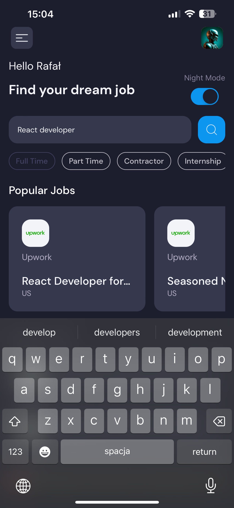

# :mechanical_arm: REACT NATIVE JOB APP

## :technologist: About project:

Welcome to my initial foray into React Native! I'm fascinated by the possibilities this technology offers, and I wanted to share the result of my work with you.

Technologies and metodologies used in this project:

**React Native / Expo / Context API / Rapid AIP / CSS in JS**

## :zap: How it works?

### :calling: API Interaction:

The app fetches data from an existing API (Rapid API) and presents it in a user-friendly way. It's a great exercise to better understand integrating external data in a React Native environment.

### :night_with_stars: Night and Day Mode:

For better user experience, I've decided to add possibility to use the app in both night and day modes. Now you can customize the app's appearance to suit your preferences!

##

### :eyeglasses: Job Search and Filtering:

I wanted my app to be practical, so I added a job search feature with the ability to filter results. Now you can easily find job listings that interest you.

##

### :hamburger: Hamburger Menu with Interactions:

The project includes a hamburger menu with a few basic interactions. It's a great place to experiment and add new features in the future maybe :thinking:.

Job Listings: Explore job opportunities effortlessly with this application dedicated to presenting job listings in an accessible and organized manner.

## :mailbox: Feel free to contact me

You can find me on **[LINKEDIN](https://www.linkedin.com/in/rafalkazik/)**
